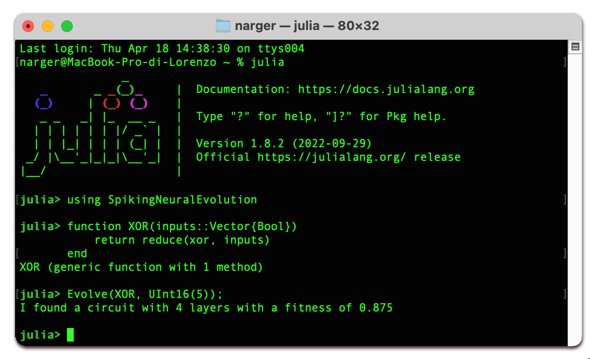

<center> 
  <h1 align="center">An Evolutionary Approach to the Design of Spiking Neural P Circuits</h1>
  <p align="center">
    </br>
    <a href="https://orcid.org/0000-0002-8105-4371"><strong>Alberto Leporati</strong></a>
    ·
    <a href="https://orcid.org/0000-0001-5093-7932"><strong>Lorenzo Rovida</strong></a>
  </p>
  <p align="center" line-height:20><sup>University of Milan-Bicocca, <br>
    Department of Informatics, Systems, and Communication, <br>
  $\texttt{\{lorenzo.rovida, alberto.leporati\}@unimib.it}$
  </sup>
  </p>
</center>

</br>
<a href='https://mcrespo.me/publications/primary-space-cv/data/crespo2021primary.pdf'>
    
</a> 
    
<!-- 

-->
---


This repository contains the source code for the work-in-progress paper _An Evolutionary Approach to the Design of Spiking Neural P Circuits_

# How it works

# How to install

The source code requires the following dependencies:
- DataFrames
- (optionally) Plots

# How to use

The source code offers a high-level API that makes it easy to run the simulations on a preferred Boolean function.

First of all, include the library: 

```
using SpikingNeuralEvolution
```

Then, define a Boolean function to be approximated. For instance, the XOR function:
```
function XOR(inputs::Vector{Bool}) 
    return reduce(xor, inputs)
end
```

How many input values should be used? Choose carefully, as the dimension of the truth table grows exponentially (as $`\Theta(2^n)`$)
```
n = 5
```

How many simulations should be performed? Each simulation consists of (by default) 1000 iterations over a set of (by default) 100 individuals
```
simulations = 20
```

Then, let the populations evolve with a single line:
```
Evolve(XOR, n, simulations)
```
